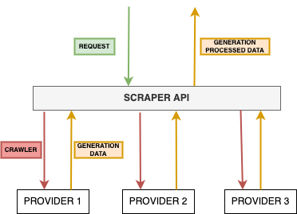

# SCRAPER API
The aim of this project is to build a microservice to crawler solar panels providers' website to collect data of energy generation per plant and also other information about the plant.
- **API:** Build with FAST API
- **Crawler:** Build with Scrapy and Requests
- **Deploy**: GKE GCloud

# About it
*Installers* (companies that installs solar panels) have a big challenge to monitor all the solar plants installed, because this data is just available in the *provider* (company that sells solar panels) website. In fact to monitor all the plants of an installer, one has to log multiple times (one for each solar plant) in different websites (depends on the equipment's provider). This API is the base to have all this data in one single place and in one monitoring dashboard.



# Dependencies
- Python: 3.10.4
- Poetry: 1.1.15
- Docker: 20.10.11
- kubectl: v4.5.7
- minikube: v1.25.2
- Google Cloud SDK: 380.0.0

# Run
```shell
make local/run_api
```

Docker
```shell
make docker/build
make docker/run
```

Kubernetes
```shell
minikube start -p minikube
eval $(minikube -p minikube docker-env)
make docker/build
make k8s/run
```

# Next Steps

1. Implement more spiders to crawl more providers websites.
2. Build another microservice using Django to server as a platform where installer will have all this data available.
